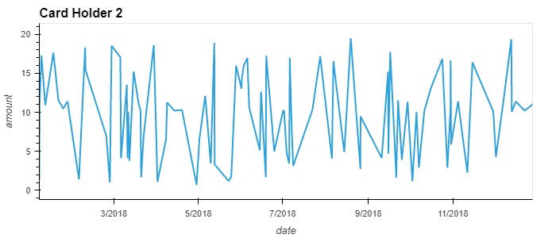
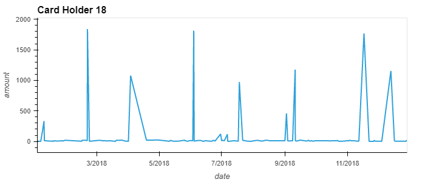
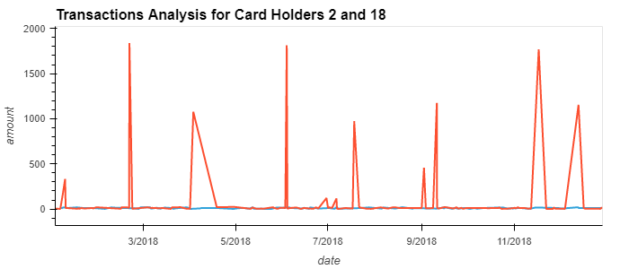
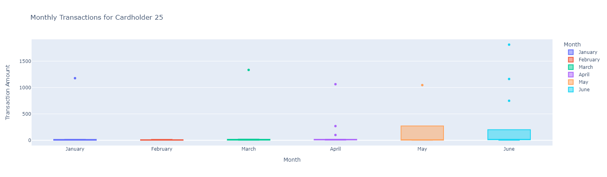

# Unit7-Homework
Unit 7 Homework Assignment: Looking for Suspicious Transactions

**ANSWERS IN BOLD**

### Data Analysis
#### Part 1:

The CFO of your firm has requested a report to help analyze potential fraudulent transactions. Using your newly created database, generate queries that will discover the information needed to answer the following questions, then use your repository's ReadME file to create a markdown report you can share with the CFO:

* Some fraudsters hack a credit card by making several small transactions (generally less than $2.00), which are typically ignored by cardholders. 

  * How can you isolate (or group) the transactions of each cardholder?
    
    **You can join the credit_card and the transaction tables by the credit card number.  From there you can reference both the transactions made with the cardholder_id.**

  * Count the transactions that are less than $2.00 per cardholder.
    
    **See query in fraud_detection_query.sql**
  
  * Is there any evidence to suggest that a credit card has been hacked? Explain your rationale.
    
    **I thouhght the data was somewhat inconclusive....all of the credit card holders have mulitiple transactions that are less than $2.00**

* Take your investigation a step futher by considering the time period in which potentially fraudulent transactions are made. 

  * What are the top 100 highest transactions made between 7:00 am and 9:00 am?
    
    **The majority of the top 100 highest transactions are less than $20...However There are 9 that range from $100 to $1894.**

  * Do you see any anomalous transactions that could be fraudulent?
    
    **Yes the top 9 transactions could be fraudulent.  They are significnatly larger than the rest of the transactions that occur during that timeframe**

  * Is there a higher number of fraudulent transactions made during this time frame versus the rest of the day?
    
    **I'm not sure...the charges throughout the rest of the day are significantly larger.  For example, at least 99 charges are for $100 or higher throughout the rest of the day.**

  * If you answered yes to the previous question, explain why you think there might be fraudulent transactions during this time frame.

* What are the top 5 merchants prone to being hacked using small transactions?
    
    **According to the HW...restaurants have the most transactions that are less than $2.00 and are therefore the most prone to being hacked.**

* Create a view for each of your queries.

#### Part 2:

Your CFO has also requested detailed trends data on specific card holders. Use the [starter notebook](Starter_Files/challenge.ipynb) to query your database and generate visualizations that supply the requested information as follows, then add your visualizations and observations to your markdown report:      

* The two most important customers of the firm may have been hacked. Verify if there are any fraudulent transactions in their history. For privacy reasons, you only know that their cardholder IDs are 2 and 18.

  * Using hvPlot, create a line plot representing the time series of transactions over the course of the year for each cardholder separately. 
  
  
  
  
  * Next, to better compare their patterns, create a single line plot that contains both card holders' trend data.  
  
  

  * What difference do you observe between the consumption patterns? Does the difference suggest a fraudulent transaction? Explain your rationale.
    
    **Cardholder 18 has a large amount of outlier transactions compared to Cardholder 2.  These outliers would suggest that Cardholder 18 has been compromised and**
    **most likely contains fraudulent charges.**

* The CEO of the biggest customer of the firm suspects that someone has used her corporate credit card without authorization in the first quarter of 2018 to pay quite expensive restaurant bills. Again, for privacy reasons, you know only that the cardholder ID in question is 25.

  * Using Plotly Express, create a box plot, representing the expenditure data from January 2018 to June 2018 for cardholder ID 25.
  
    

  * Are there any outliers for cardholder ID 25? How many outliers are there per month?
    
    **Cardholder 25 has multiple outliers according to the box plot.  One outlier occurs in the months of Jan Mar**
    **and May, while April and June have three.  Feb doesn't have an outlier**

  * Do you notice any anomalies? Describe your observations and conclusions.

    **Yes, there are some anomalies.  April and June have rouhgly 3x the amount of outliers compared to the rest of the months.  Those charges should be looked**
    **into further to verify if they were fraudulent or not.**
